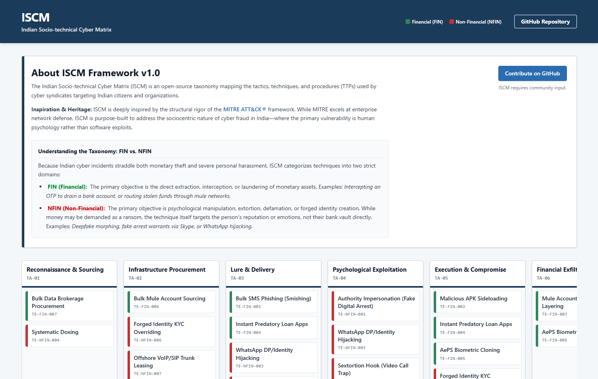
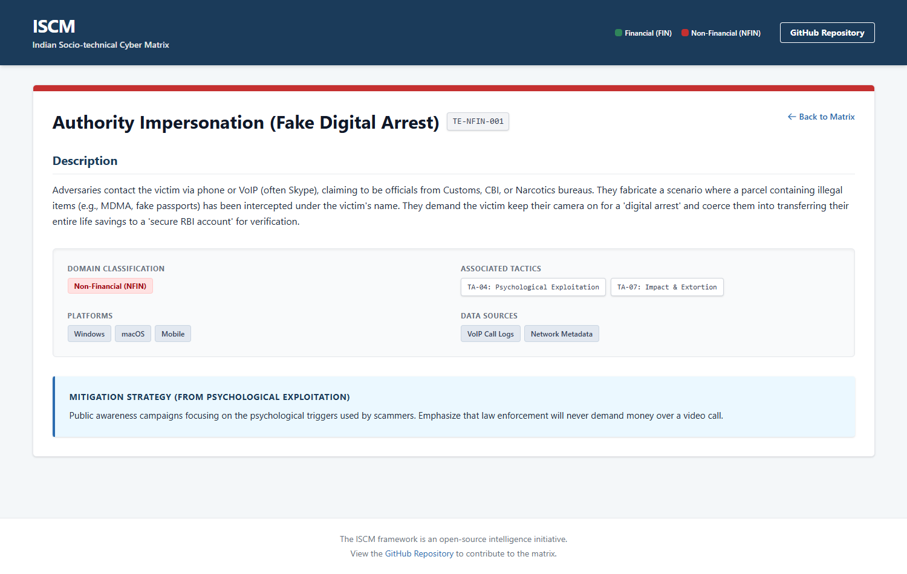

# Indian Socio-technical Cyber Matrix (ISCM)

ISCM is an open-source, intelligence-driven framework documenting the tactics, techniques, and procedures (TTPs) deployed by cybercrime syndicates targeting Indian citizens, organizations, and critical infrastructure.

Unlike enterprise-focused frameworks that primarily track technical network breaches, ISCM recognizes that the vast majority of substantial fraud in India is socio-technical. The vulnerability is human emotion or urgency; the infrastructure is often forged telecom or banking access rather than advanced malware.



## Inspiration and Acknowledgment

This project is heavily inspired by the foundational structure and visual presentation of the **MITRE ATT&CK** framework. We aim to bring that same rigorous standard of documentation, intelligence sharing, and defensive planning to the sociocentric cyber landscape in India.

## The ISCM Taxonomy

ISCM currently tracks two pillars of Indian cyber threats: Tactics and
Techniques (a third pillar, Adversary Groups, is planned — see
[FUTURE_WORK.md](./FUTURE_WORK.md)).

Because Indian cybercrime straddles both severe monetary extortion and extreme personal harassment, the framework categorizes all operational techniques into two strict domains:

- **FIN (Financial):** The primary objective is the direct extraction, interception, or laundering of monetary assets. _Examples: Intercepting an OTP to drain a bank account, or routing stolen funds through mule networks._
- **NFIN (Non-Financial):** The primary objective is psychological manipulation, extortion, defamation, or forged identity creation. While money may be demanded as a ransom, the technique itself targets the person's reputation or emotions, not their bank vault directly. _Examples: Deepfake morphing, fake arrest warrants via Skype, or WhatsApp hijacking._

### The ISCM Kill Chain (Tactics)

The core Indian socio-technical kill chain generally follows a 7-stage process,
plus 2 additional NFIN-specific tactics for cases that move beyond a single
attack chain into sustained reputational/personal harm:

1.  **TA-01: Reconnaissance & Sourcing** (Data brokerage, OSINT)
2.  **TA-02: Infrastructure Procurement** (Mule accounts, pre-activated VoIP/SIMs)
3.  **TA-03: Lure & Delivery** (SMS Blasting, Social Media Ads)
4.  **TA-04: Psychological Exploitation** (Weaponization of Fear or Greed)
5.  **TA-05: Execution & Compromise** (APK installation, Screen Sharing, OTP sharing)
6.  **TA-06: Financial Exfiltration** (Mule hopping, Crypto conversion)
7.  **TA-07: Impact & Extortion** (Sustained blackmail, financial loss)
8.  **TA-08: Reputation Sabotage** (NFIN) (Deepfakes, defamatory content)
9.  **TA-09: Harassment & Stalking** (NFIN) (Persistent unwanted contact, cyberstalking)

## Viewing the Matrix

The framework is deployed as a React application with a Matrix user interface. You can view the live, interactive matrix here:
**[View the ISCM Framework](https://jampanikomal.github.io/ISCM/)**

Clicking any technique opens its detail page with domain, associated
tactics, platforms, data sources, and the relevant mitigation strategy:



## Tech stack

React 19 + TypeScript + Vite, styled with Tailwind CSS, routed with
React Router, deployed to GitHub Pages via the `gh-pages` package.

## Running it locally

```bash
npm install
npm run dev
```

To produce a production build (also regenerates `dist/404.html`, a copy of
`index.html` that lets GitHub Pages serve direct links like `/tactics/TA-01`
correctly instead of a real 404 — GitHub Pages has no server-side routing,
so a static SPA needs this):

```bash
npm run build
npm run preview
```

## Contributing

ISCM relies entirely on the intelligence reporting of the cybersecurity community, banking nodal officers, open-source researchers, and law enforcement feedback. See the [CONTRIBUTING.md](./CONTRIBUTING.md) file for guidelines on how to propose new Techniques or TTPs via Pull Requests.

## Known limitations

- Data (`src/data/tactics.ts`, `src/data/techniques.ts`) is hand-authored
  TypeScript, not backed by any API or database — adding a TTP means a pull
  request, not a form submission.
- No automated tests yet; correctness relies on TypeScript's type checking
  (a `Technique`'s `tacticIds` aren't validated against real `Tactic` IDs at
  build time) and manual review of PRs.
- See [FUTURE_WORK.md](./FUTURE_WORK.md) for the larger roadmap (Adversary
  Group mapping, sub-techniques, a public API, etc.).

## License

This project is licensed under the MIT License - see the [LICENSE](./LICENSE) file for details.
