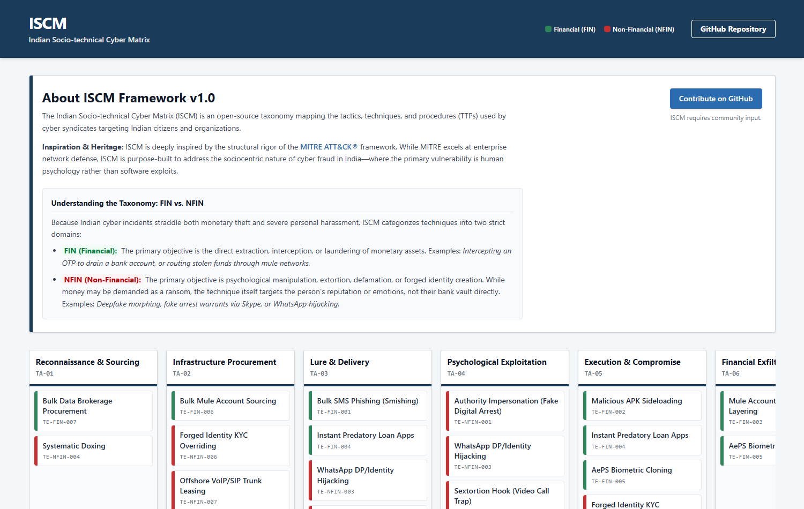
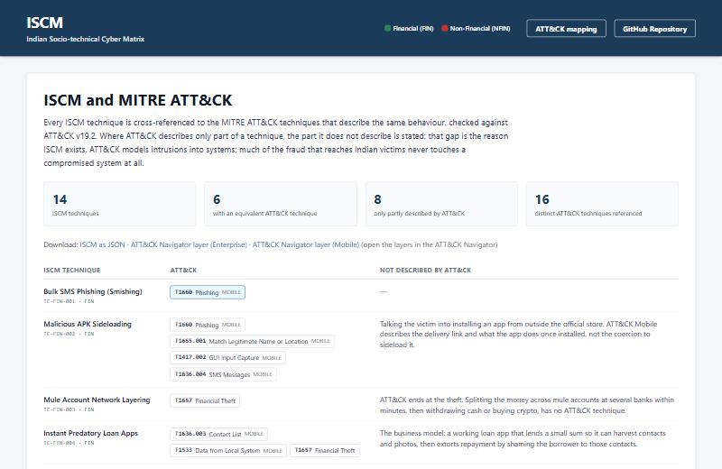
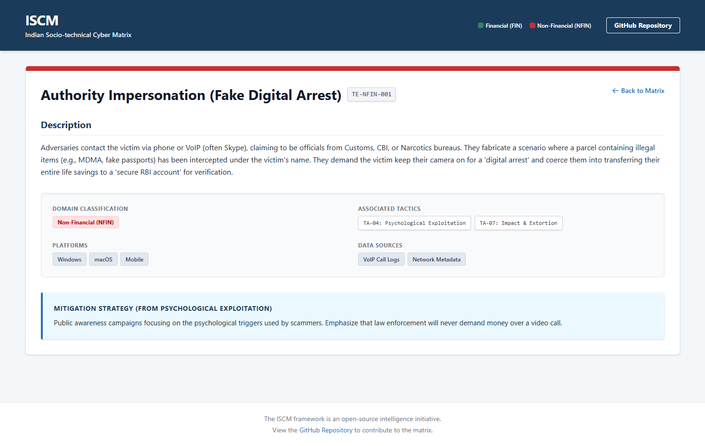

# Indian Socio-technical Cyber Matrix (ISCM)

[](https://github.com/JampaniKomal/ISCM/actions/workflows/ci.yml)

ISCM is an open-source, intelligence-driven framework documenting the tactics, techniques, and procedures (TTPs) deployed by cybercrime syndicates targeting Indian citizens, organizations, and critical infrastructure.

Unlike enterprise-focused frameworks that primarily track technical network breaches, ISCM recognizes that the vast majority of substantial fraud in India is socio-technical. The vulnerability is human emotion or urgency; the infrastructure is often forged telecom or banking access rather than advanced malware.

**[View the live matrix](https://jampanikomal.github.io/ISCM/)** · **[ISCM and MITRE ATT&CK](https://jampanikomal.github.io/ISCM/attack)**



ISCM was built as the capstone project of my internship at the Telangana Cyber Security Bureau (TGCSB).

## Inspiration and Acknowledgment

This project is heavily inspired by the foundational structure and visual presentation of the **MITRE ATT&CK** framework. We aim to bring that same rigorous standard of documentation, intelligence sharing, and defensive planning to the sociocentric cyber landscape in India.

## The ISCM Taxonomy

ISCM currently tracks two pillars of Indian cyber threats: Tactics and
Techniques (a third pillar, Adversary Groups, is planned — see
[FUTURE_WORK.md](./FUTURE_WORK.md)).

Because Indian cybercrime straddles both severe monetary extortion and extreme personal harassment, the framework categorizes all operational techniques into two strict domains:

- **FIN (Financial):** The primary objective is the direct extraction, interception, or laundering of monetary assets. _Examples: Intercepting an OTP to drain a bank account, or routing stolen funds through mule networks._
- **NFIN (Non-Financial):** The primary objective is psychological manipulation, extortion, defamation, or forged identity creation. While money may be demanded as a ransom, the technique itself targets the person's reputation or emotions, not their bank vault directly. _Examples: Deepfake morphing, fake arrest warrants via Skype, or WhatsApp hijacking._

### The ISCM Kill Chain (Tactics)

The core Indian socio-technical kill chain generally follows a 7-stage process,
plus 2 additional NFIN-specific tactics for cases that move beyond a single
attack chain into sustained reputational/personal harm:

1.  **TA-01: Reconnaissance & Sourcing** (Data brokerage, OSINT)
2.  **TA-02: Infrastructure Procurement** (Mule accounts, pre-activated VoIP/SIMs)
3.  **TA-03: Lure & Delivery** (SMS Blasting, Social Media Ads)
4.  **TA-04: Psychological Exploitation** (Weaponization of Fear or Greed)
5.  **TA-05: Execution & Compromise** (APK installation, Screen Sharing, OTP sharing)
6.  **TA-06: Financial Exfiltration** (Mule hopping, Crypto conversion)
7.  **TA-07: Impact & Extortion** (Sustained blackmail, financial loss)
8.  **TA-08: Reputation Sabotage** (NFIN) (Deepfakes, defamatory content)
9.  **TA-09: Harassment & Stalking** (NFIN) (Persistent unwanted contact, cyberstalking)

Fourteen techniques are documented: seven FIN (smishing, malicious APK
sideloading, mule-account layering, predatory loan apps, AePS biometric
cloning, bulk mule-account sourcing, data brokerage) and seven NFIN (fake
"digital arrest", morphed-image blackmail, WhatsApp identity hijacking,
doxing, sextortion video calls, forged-identity KYC, offshore VoIP leasing).

## ISCM and MITRE ATT&CK

Every ISCM technique is cross-referenced to the MITRE ATT&CK techniques
(Enterprise and Mobile) that describe the same behaviour, and each reference
says whether ATT&CK describes all of it (**equivalent**) or one step of it
(**partial**). Where ATT&CK only partly covers a technique, ISCM states what
it leaves out. That gap is the reason ISCM exists: ATT&CK models intrusions
into systems, and much of the fraud that reaches Indian victims never touches
a compromised system.

| | |
|---|---|
| ISCM techniques | 14 |
| with an equivalent ATT&CK technique | 6 (e.g. fake digital arrest → [T1684.001 Impersonation](https://attack.mitre.org/techniques/T1684/001/); smishing → [T1660 Phishing](https://attack.mitre.org/techniques/T1660/) (Mobile)) |
| only partly described by ATT&CK | 8 (e.g. mule-account layering: ATT&CK ends at [T1657 Financial Theft](https://attack.mitre.org/techniques/T1657/) and has no technique for laundering the money) |
| distinct ATT&CK techniques referenced | 16 (10 Enterprise, 6 Mobile) |

The references are checked, not just typed: `src/data/attack-reference.json`
is extracted from MITRE's official STIX data (ATT&CK v19.2) by
`npm run attack:update`, and the tests fail if any reference uses an ID that
does not exist, a deprecated or revoked technique, or a name or domain that
differs from MITRE's.

The full table is on the [ATT&CK mapping page](https://jampanikomal.github.io/ISCM/attack),
and each technique page lists its references and gap.



## Data and exports

Every build publishes the framework as data, generated from the same source
as the site:

- [`data/iscm.json`](https://jampanikomal.github.io/ISCM/data/iscm.json): all tactics and techniques, with their ATT&CK references;
- [`data/iscm-attack-enterprise-layer.json`](https://jampanikomal.github.io/ISCM/data/iscm-attack-enterprise-layer.json) and
  [`data/iscm-attack-mobile-layer.json`](https://jampanikomal.github.io/ISCM/data/iscm-attack-mobile-layer.json):
  [ATT&CK Navigator](https://mitre-attack.github.io/attack-navigator/) layers
  that colour the ATT&CK techniques ISCM maps to, scored by how many ISCM
  techniques use each one.

## Viewing the Matrix

The framework is deployed as a React application with a Matrix user interface:
**[jampanikomal.github.io/ISCM](https://jampanikomal.github.io/ISCM/)**. The
matrix can be filtered to FIN or NFIN techniques and searched by name,
platform or ATT&CK ID (try `AePS`, `WhatsApp` or `T1657`).

Clicking any technique opens its detail page with domain, associated
tactics, platforms, data sources, its ATT&CK references and gap, and the
mitigation for each tactic it serves:



## Tech stack

React 19 + TypeScript + Vite, styled with Tailwind CSS, routed with
React Router, tested with Vitest, and deployed to GitHub Pages by GitHub
Actions on every push to `main`.

## Running it locally

```bash
npm install
npm run dev        # also writes public/data/ (npm run export)
npm test           # data checks: IDs, tactic links, ATT&CK references, Navigator layers
```

To produce a production build (also regenerates `dist/404.html`, a copy of
`index.html` that lets GitHub Pages serve direct links like `/tactics/TA-01`
correctly instead of a real 404 — GitHub Pages has no server-side routing,
so a static SPA needs this):

```bash
npm run build
npm run preview
```

## Tests and CI

`src/data/data.test.ts` checks the framework as data: tactic IDs are
sequential and each has at least one technique; technique IDs are unique and
match their domain; every technique links to existing tactics of its own
domain (a FIN technique cannot sit under an NFIN-only tactic); every ATT&CK
reference is a current ATT&CK technique with MITRE's name and domain; every
technique that ATT&CK only partly describes states its gap; and the Navigator
layers score every reference exactly once. CI runs lint, the tests and the
build on every push and pull request, and publishes the site from `main`.

## Contributing

ISCM relies entirely on the intelligence reporting of the cybersecurity community, banking nodal officers, open-source researchers, and law enforcement feedback. See the [CONTRIBUTING.md](./CONTRIBUTING.md) file for guidelines on how to propose new Techniques or TTPs via Pull Requests.

## Known limitations

- Data (`src/data/tactics.ts`, `src/data/techniques.ts`) is hand-authored
  TypeScript, not backed by any API or database — adding a TTP means a pull
  request, not a form submission.
- Techniques do not yet cite sources (advisories, FIRs, news reports); the
  descriptions rest on the author's internship work and public reporting.
- Mitigations are recorded per tactic, not per technique, so a technique page
  shows the general mitigation for each stage it belongs to.
- The ATT&CK references are judgement calls about overlapping behaviour, made
  against ATT&CK v19.2; the tests prove the IDs and names are right, not that
  the mapping is the only reasonable one.
- See [FUTURE_WORK.md](./FUTURE_WORK.md) for the larger roadmap (Adversary
  Group mapping, sub-techniques, a public API, etc.).

## License

This project is licensed under the MIT License - see the [LICENSE](./LICENSE) file for details.
MITRE ATT&CK® is a registered trademark of The MITRE Corporation; ISCM is not
affiliated with MITRE.
